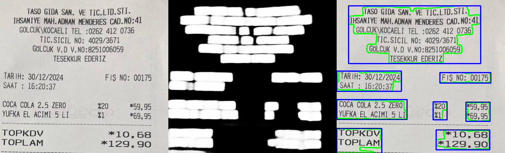

# 🚀 U-Net ile Metin Tespiti Sistemi

ICDAR veri seti üzerinde eğitilmiş U-Net tabanlı metin segmentasyon modeli.

## ✨ Temel Özellikler
- **Optimize U-Net Modeli**: 4 katmanlı encoder-decoder yapısı
- **Akıllı Kayıp Fonksiyonu**: BCE + Dice Loss kombinasyonu
- **Büyük Görüntü Desteği**: 512x512 tile'lar ile işlem yapabilme
- **Eğitim Esnekliği**: Yarıda kalan eğitime devam edebilme
- **Gelişmiş Post-Processing**: Morfolojik işlemler ve kontur analizi

## ⚙️ Kurulum

pip install torch torchvision opencv-python numpy matplotlib shapely tqdm
🏃‍♂️ Kullanım

Eğitim
python
python train.py \
    --tile_size 512 \
    --stride 256 \
    --resume checkpoints/last_checkpoint.pth

📊 Veri Seti
ICDAR 2015 veri seti kullanılmıştır:

1000+ eğitim görseli

Metin koordinatları için .txt annotasyonları

Çeşitli diller ve metin yönelimleri

        eğitim 

        eğitim 

        test

